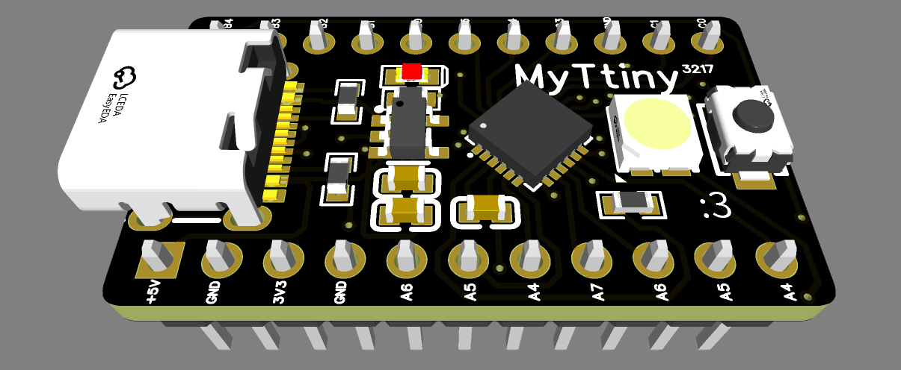
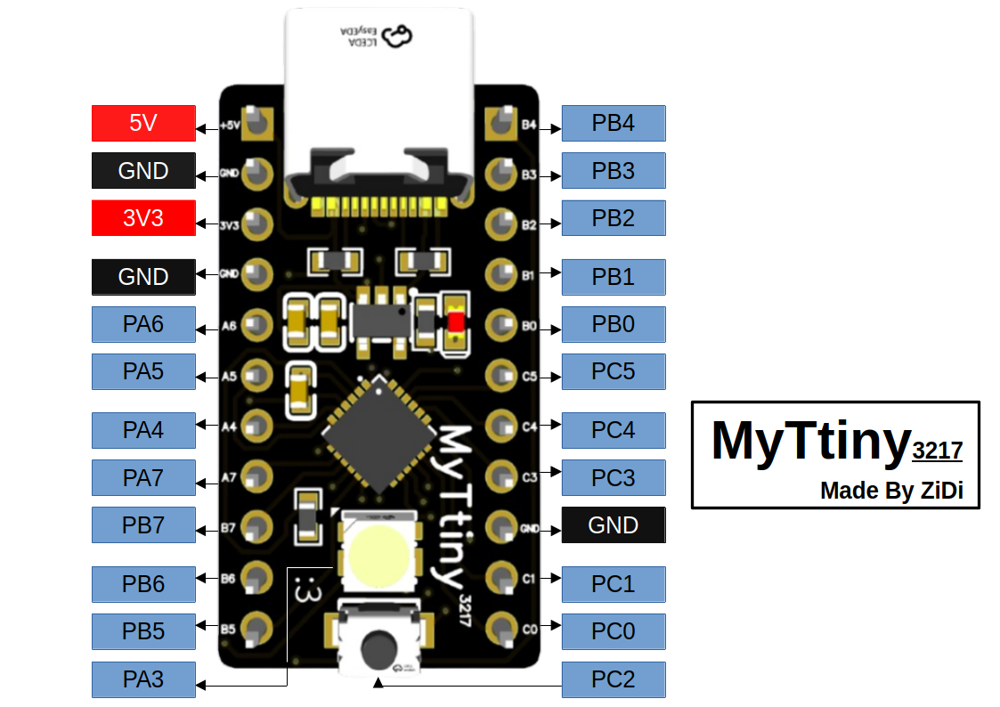
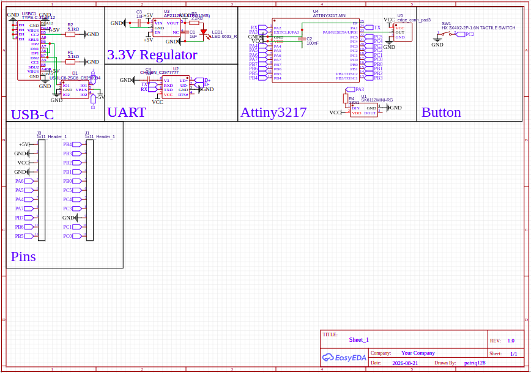
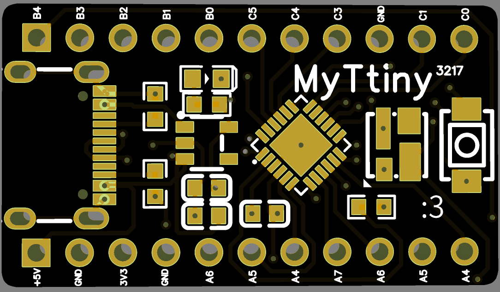
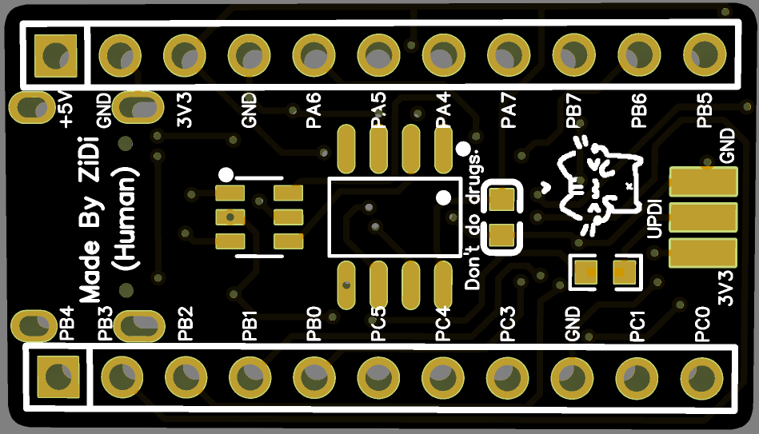

# MyTtiny

My own development board based on the **ATtiny3217** microcontroller.

## Features

One of the main reasons I made this board was for my own projects. However, I also wanted to make it useful enough for other people to use.

- **Compact size**

  I tried to make this board as small as possible, and I think I did a pretty good job. The board measures only **29.718 × 17.018 mm**.

- **USB-C**

  The board uses a USB-C connector, making it easy to power, program, and communicate with. I also included the required configuration resistors, so **USB-C to USB-C cables work properly**.

- **UART**

  I decided to add a **CH340N** USB-to-UART converter. This allows the board to communicate with a computer through USB and makes it possible to upload programs and use a serial monitor.

- **NeoPixel LED**

  I wanted the board to provide visual feedback without requiring any external hardware, so I added a programmable RGB LED.

- **Labeled Pins**

  Every header pin is labeled on both the top and bottom sides of the PCB, making it easier to identify the pins regardless of which side of the board you are looking at.

## Hardware

  ### Microcontroller

  For this board, I decided to use the **ATtiny3217**. It is small, power-efficient, and capable enough for a wide range of simple embedded projects.

  ### USB Interface

  The board uses a USB-C connector. I chose USB-C because it is compact, modern, and convenient to use.

  I also added a USB protection chip to help protect the USB data lines from electrical faults.

  The USB interface is connected to a **CH340N** USB-to-UART converter, which provides serial communication between the computer and the ATtiny3217.

  ### Power

  There are two voltage levels available on the board:

  - **5V** — Supplied by the USB-C connector or the 5V pin header. It is regulated down to 3.3V using an **AP2112K** voltage regulator.
  - **3.3V** — This is the main operating voltage of the board.

  I also added a small red LED to indicate when the board is powered.

  ### NeoPixel LED

  The board includes an **SK6812MINI** programmable RGB LED. It can be controlled by the ATtiny3217 and used to display different colors or provide visual feedback.

  ### Button

  There is also a small user button that can be used for any purpose in your code.

## Programming

  ### Bootloader

  Before uploading your first program, you need to install a bootloader on the ATtiny3217.

  The bootloader can be uploaded using the **three UPDI pins** located at the bottom of the board.

  For this project, I am using the bootloader provided by **[MegaTinyCore](https://github.com/SpenceKonde/megaTinyCore)**.

  ### UART Programming

  Once the bootloader is installed, you can upload programs and use the serial monitor through the USB-C port connected to the **CH340N** USB-to-UART converter.

## Pinout

The name of every pin is printed on both the top and bottom sides of the PCB.

> **Note:** On the top side, the pins are labeled without the **"P"** prefix.

### Official Pinout Image

## Board

  ### Schematic

  I tried to make the schematic as clean and easy to understand as possible.

  

  ### PCB

  #### Top

  

  #### Bottom

  

## Production

The main purpose of this project is to get it manufactured. I plan to have it manufactured by **JLCPCB**, which will produce the PCBs and assemble the components for me.

In the `production` folder, you can find:

- **Gerber files**
- **Pick-and-place file**
- **BOM file**

## Why I Made This

Honestly, I originally made this board because I was bored.

I also didn't really want to use some of the existing development boards available to me, so I decided to design my own.

I chose the **ATtiny3217** as the main microcontroller because I wanted to try something different instead of using more common chips such as the RP2040 or ESP32.

In the end, it became a small development board that I can use for my own projects while also making the design available for anyone else who might find it useful.